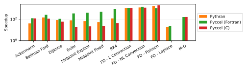

# Benchmarks

Several tests are available for the user to benchmark Pyccel against other common accelerators, notably [pythran](https://pythran.readthedocs.io/en/latest/) and [numba](https://numba.pydata.org/).
The same code is used for all tests, only the decorators change.

The dependencies can be installed using the command `python3 -m pip install .`

The code can be executed by running the script `benchmarks/run_benchmarks.py`.
Additional options can be used with this script to add additional comparisons, change the output format, or change what is generated.

Run `python3 benchmarks/run_benchmarks.py --help` for more details.

The results below are presented for the current state of the development branch of pyccel, as well as the most recent version of pyccel available on pypi.

A requirements.txt file providing the necessary packages to reproduce the tests run can be found in the `version_specific_results` folder.
The environment can be reproduced using the following commands:
```
python3 -m venv my_virtual_environment
source my_virtual_environment/bin/activate
pip3 install -r requirements.txt
```
## Tests used

The tests used can be found in the [benchmarks/tests](./benchmarks/tests) directory.

### Ackermann

A basic implementation of the Ackermann function which is one of the simplest and oldest examples of a total computable function that is not primitive recursive.

### Bellman Ford

An algorithm for solving the shortest path problem. The code is adapted from examples written by [J. Burkardt](https://people.sc.fsu.edu/~jburkardt/py_src/py_src.html)

### Djikstra

An algorithm for solving the shortest path problem. The code is adapted from examples written by [J. Burkardt](https://people.sc.fsu.edu/~jburkardt/py_src/py_src.html)

### Euler

Solves an ordinary differential equation using Euler's method. The code is adapted from examples written by [J. Burkardt](https://people.sc.fsu.edu/~jburkardt/py_src/py_src.html)

### Midpoint Explicit

Solves an ordinary differential equation using the explicit midpoint method. The code is adapted from examples written by [J. Burkardt](https://people.sc.fsu.edu/~jburkardt/py_src/py_src.html)

### Midpoint Fixed

Solves an ordinary differential equation using the implicit midpoint method with a fixed number of iterations. The code is adapted from examples written by [J. Burkardt](https://people.sc.fsu.edu/~jburkardt/py_src/py_src.html)

### RK4

Solves an ordinary differential equation using a fourth order Runge-Kutta method. The code is adapted from examples written by [J. Burkardt](https://people.sc.fsu.edu/~jburkardt/py_src/py_src.html)

### FD - Linear Convection

Solves a 1D linear convection problem using Finite Differences methods. The code is adapted from examples written by [L. A. Barba](https://lorenabarba.com/blog/cfd-python-12-steps-to-navier-stokes/)

### FD - Non-Linear Convection

Solves a 1D non-linear convection problem using Finite Differences methods. The code is adapted from examples written by [L. A. Barba](https://lorenabarba.com/blog/cfd-python-12-steps-to-navier-stokes/)

### FD - Poisson

Solves a 2D Poisson problem using Finite Differences methods. The code is adapted from examples written by [L. A. Barba](https://lorenabarba.com/blog/cfd-python-12-steps-to-navier-stokes/)

### FD - Laplace

Solves a 2D Laplace problem using Finite Differences methods. The code is adapted from examples written by [L. A. Barba](https://lorenabarba.com/blog/cfd-python-12-steps-to-navier-stokes/)

### MD

Runs a molecular dynamics simulation. The code is adapted from examples written by [J. Burkardt](https://people.sc.fsu.edu/~jburkardt/py_src/py_src.html)
## Development branch results
### Performance Comparison (as of Mon Dec 19 09:31:48 UTC 2022)
## Compilation time
Algorithm                 | python                    | pythran                   | numba                     | pyccel                    | pyccel_c                 
------------------------- | ------------------------- | ------------------------- | ------------------------- | ------------------------- | -------------------------
Ackermann                 | -                         | 2.84                      | 0.47                      | 1.68                      | 1.62                     
Bellman Ford              | -                         | 3.60                      | 1.23                      | 2.51                      | 2.41                     
Dijkstra                  | -                         | 3.65                      | 1.72                      | 2.62                      | 2.42                     
Euler                     | -                         | 4.34                      | 1.66                      | 2.54                      | 2.39                     
Midpoint Explicit         | -                         | 4.98                      | 2.50                      | 2.93                      | 2.98                     
Midpoint Fixed            | -                         | 5.60                      | 3.01                      | 3.13                      | 3.06                     
RK4                       | -                         | 5.99                      | 3.04                      | 3.64                      | 3.55                     
FD - L Convection         | -                         | 3.36                      | 0.42                      | 2.42                      | 2.41                     
FD - NL Convection        | -                         | 3.45                      | 0.43                      | 2.40                      | 2.38                     
FD - Poisson              | -                         | 9.59                      | 0.99                      | 2.57                      | 2.50                     
FD - Laplace              | -                         | 14.33                     | 2.20                      | 3.30                      | -                        
M-D                       | -                         | -                         | 5.90                      | 3.94                      | 3.43                     

## Execution time
Algorithm                 | python                    | pythran                   | numba                     | pyccel                    | pyccel_c                 
------------------------- | ------------------------- | ------------------------- | ------------------------- | ------------------------- | -------------------------
Ackermann (ms)            | 484.00                    | 4.94                      | 31.70                     | 2.24                      | 2.36                     
Bellman Ford (ns)         | 69600.00                  | 449.00                    | 700.00                    | 290.00                    | 602.00                   
Dijkstra (ns)             | 35300.00                  | 461.00                    | 600.00                    | 334.00                    | 703.00                   
Euler (ms)                | 55.60                     | 0.81                      | 1.19                      | 0.21                      | 3.84                     
Midpoint Explicit (ms)    | 111.00                    | 1.80                      | 3.02                      | 0.32                      | 6.06                     
Midpoint Fixed (ms)       | 573.00                    | 10.80                     | 15.20                     | 1.26                      | 26.00                    
RK4 (ms)                  | 278.00                    | 2.37                      | 5.00                      | 0.39                      | 8.28                     
FD - L Convection (ms)    | 2660.00                   | 2.10                      | 11.20                     | 2.59                      | 3.30                     
FD - NL Convection (ms)   | 3310.00                   | 2.32                      | 10.60                     | 2.32                      | 3.27                     
FD - Poisson (ms)         | 5390.00                   | 4.31                      | 11.80                     | 5.65                      | 3.97                     
FD - Laplace (\textmu s)  | 70.70                     | 3.24                      | 11600.00                  | 2.79                      | -                        
M-D (ms)                  | 56600.00                  | -                         | 297.00                    | 366.00                    | 358.00                   


## Python 3.7 results
### Performance Comparison (as of 1.7.1)
## Compilation time
Algorithm                 | python                    | pythran                   | numba                     | pyccel                    | pyccel_c                 
------------------------- | ------------------------- | ------------------------- | ------------------------- | ------------------------- | -------------------------
Ackermann                 | -                         | 1.90                      | 0.36                      | 1.50                      | 1.35                     
Bellman Ford              | -                         | 2.51                      | 1.02                      | 2.23                      | 2.20                     
Dijkstra                  | -                         | 2.53                      | 1.31                      | 2.31                      | 2.20                     
Euler                     | -                         | 2.99                      | 1.35                      | 2.36                      | 2.21                     
Midpoint Explicit         | -                         | 3.60                      | 2.06                      | 2.60                      | 2.54                     
Midpoint Fixed            | -                         | 4.17                      | 2.38                      | 2.66                      | 2.65                     
RK4                       | -                         | 4.38                      | 2.46                      | 3.20                      | 3.13                     
FD - L Convection         | -                         | 2.24                      | 0.33                      | 2.13                      | 2.11                     
FD - NL Convection        | -                         | 2.24                      | 0.32                      | 2.13                      | 2.12                     
FD - Poisson              | -                         | 6.90                      | 0.79                      | 2.23                      | 2.20                     
FD - Laplace              | -                         | 10.33                     | 1.80                      | 2.87                      | -                        
M-D                       | -                         | -                         | 5.36                      | 3.31                      | 3.02                     

## Execution time
Algorithm                 | python                    | pythran                   | numba                     | pyccel                    | pyccel_c                 
------------------------- | ------------------------- | ------------------------- | ------------------------- | ------------------------- | -------------------------
Ackermann (ms)            | 520.00 $\pm$ 9.00         | 8.93 $\pm$ 0.01           | 30.80 $\pm$ 0.30          | 3.17 $\pm$ 0.00           | 2.94 $\pm$ 0.00          
Bellman Ford (ns)         | 64100.00 $\pm$ 1300.00    | 373.00 $\pm$ 1.00         | 544.00 $\pm$ 10.00        | 227.00 $\pm$ 1.00         | 487.00 $\pm$ 4.00        
Dijkstra (ns)             | 34000.00 $\pm$ 500.00     | 321.00 $\pm$ 0.00         | 374.00 $\pm$ 3.00         | 277.00 $\pm$ 0.00         | 472.00 $\pm$ 3.00        
Euler (ms)                | 56.10 $\pm$ 1.20          | 0.77 $\pm$ 0.00           | 1.13 $\pm$ 0.01           | 0.13 $\pm$ 0.01           | 2.96 $\pm$ 0.02          
Midpoint Explicit (ms)    | 115.00 $\pm$ 2.00         | 1.53 $\pm$ 0.00           | 2.90 $\pm$ 0.05           | 0.23 $\pm$ 0.01           | 5.28 $\pm$ 0.03          
Midpoint Fixed (ms)       | 569.00 $\pm$ 8.00         | 9.60 $\pm$ 0.17           | 15.90 $\pm$ 0.10          | 0.96 $\pm$ 0.06           | 23.30 $\pm$ 0.00         
RK4 (ms)                  | 260.00 $\pm$ 5.00         | 1.93 $\pm$ 0.01           | 5.73 $\pm$ 0.07           | 0.27 $\pm$ 0.00           | 6.32 $\pm$ 0.04          
FD - L Convection (ms)    | 2210.00 $\pm$ 40.00       | 1.53 $\pm$ 0.02           | 9.36 $\pm$ 0.04           | 1.65 $\pm$ 0.00           | 1.71 $\pm$ 0.02          
FD - NL Convection (ms)   | 3190.00 $\pm$ 40.00       | 1.87 $\pm$ 0.01           | 9.22 $\pm$ 0.02           | 1.73 $\pm$ 0.02           | 1.65 $\pm$ 0.01          
FD - Poisson (ms)         | 4670.00 $\pm$ 90.00       | 2.03 $\pm$ 0.00           | 10.40 $\pm$ 0.00          | 3.88 $\pm$ 0.00           | 1.75 $\pm$ 0.00          
FD - Laplace (\textmu s)  | 50.10 $\pm$ 1.00          | 2.37 $\pm$ 0.01           | 8.76 $\pm$ 0.06           | 1.97 $\pm$ 0.01           | -                        
M-D (ms)                  | 52600.00 $\pm$ 1100.00    | -                         | 224.00 $\pm$ 3.00         | 269.00 $\pm$ 0.00         | 274.00 $\pm$ 0.00        


## Python 3.8 results
### Performance Comparison (as of 1.7.1)
## Compilation time
Algorithm                 | python                    | pythran                   | numba                     | pyccel                    | pyccel_c                 
------------------------- | ------------------------- | ------------------------- | ------------------------- | ------------------------- | -------------------------
Ackermann                 | -                         | 1.82                      | 0.33                      | 1.45                      | 1.34                     
Bellman Ford              | -                         | 2.45                      | 0.96                      | 2.27                      | 2.16                     
Dijkstra                  | -                         | 2.52                      | 1.27                      | 2.36                      | 2.25                     
Euler                     | -                         | 2.96                      | 1.32                      | 2.27                      | 2.22                     
Midpoint Explicit         | -                         | 3.55                      | 2.04                      | 2.59                      | 2.53                     
Midpoint Fixed            | -                         | 4.05                      | 2.33                      | 2.72                      | 2.66                     
RK4                       | -                         | 4.27                      | 2.41                      | 3.19                      | 3.10                     
FD - L Convection         | -                         | 2.24                      | 0.32                      | 2.14                      | 2.11                     
FD - NL Convection        | -                         | 2.23                      | 0.32                      | 2.14                      | 2.16                     
FD - Poisson              | -                         | 7.00                      | 0.75                      | 2.33                      | 2.24                     
FD - Laplace              | -                         | 10.58                     | 1.74                      | 2.88                      | -                        
M-D                       | -                         | -                         | 5.26                      | 3.30                      | 3.00                     

## Execution time
Algorithm                 | python                    | pythran                   | numba                     | pyccel                    | pyccel_c                 
------------------------- | ------------------------- | ------------------------- | ------------------------- | ------------------------- | -------------------------
Ackermann (ms)            | 479.00 $\pm$ 3.00         | 10.40 $\pm$ 0.00          | 32.30 $\pm$ 0.30          | 3.32 $\pm$ 0.00           | 3.26 $\pm$ 0.00          
Bellman Ford (ns)         | 58800.00 $\pm$ 300.00     | 378.00 $\pm$ 2.00         | 540.00 $\pm$ 3.00         | 228.00 $\pm$ 1.00         | 493.00 $\pm$ 5.00        
Dijkstra (ns)             | 30500.00 $\pm$ 100.00     | 329.00 $\pm$ 2.00         | 352.00 $\pm$ 4.00         | 259.00 $\pm$ 2.00         | 465.00 $\pm$ 5.00        
Euler (ms)                | 46.60 $\pm$ 0.40          | 0.63 $\pm$ 0.02           | 1.27 $\pm$ 0.01           | 0.14 $\pm$ 0.00           | 2.59 $\pm$ 0.03          
Midpoint Explicit (ms)    | 94.70 $\pm$ 0.80          | 1.43 $\pm$ 0.02           | 3.16 $\pm$ 0.04           | 0.24 $\pm$ 0.01           | 4.58 $\pm$ 0.14          
Midpoint Fixed (ms)       | 480.00 $\pm$ 4.00         | 8.83 $\pm$ 0.21           | 17.60 $\pm$ 0.30          | 0.96 $\pm$ 0.01           | 20.00 $\pm$ 0.30         
RK4 (ms)                  | 237.00 $\pm$ 2.00         | 2.08 $\pm$ 0.03           | 6.36 $\pm$ 0.14           | 0.28 $\pm$ 0.00           | 5.52 $\pm$ 0.19          
FD - L Convection (ms)    | 2360.00 $\pm$ 30.00       | 1.95 $\pm$ 0.00           | 9.15 $\pm$ 0.13           | 1.85 $\pm$ 0.00           | 1.81 $\pm$ 0.00          
FD - NL Convection (ms)   | 2910.00 $\pm$ 30.00       | 1.92 $\pm$ 0.01           | 9.44 $\pm$ 0.16           | 1.61 $\pm$ 0.00           | 1.56 $\pm$ 0.00          
FD - Poisson (ms)         | 4140.00 $\pm$ 10.00       | 2.37 $\pm$ 0.00           | 10.90 $\pm$ 0.10          | 3.98 $\pm$ 0.08           | 2.06 $\pm$ 0.03          
FD - Laplace (\textmu s)  | 53.00 $\pm$ 0.80          | 2.46 $\pm$ 0.04           | 8.95 $\pm$ 0.08           | 2.10 $\pm$ 0.02           | -                        
M-D (ms)                  | 50100.00 $\pm$ 900.00     | -                         | 231.00 $\pm$ 2.00         | 304.00 $\pm$ 1.00         | 303.00 $\pm$ 3.00        


## Python 3.9 results
### Performance Comparison (as of 1.7.1)
## Compilation time
Algorithm                 | python                    | pythran                   | numba                     | pyccel                    | pyccel_c                 
------------------------- | ------------------------- | ------------------------- | ------------------------- | ------------------------- | -------------------------
Ackermann                 | -                         | 2.71                      | 0.49                      | 2.09                      | 1.86                     
Bellman Ford              | -                         | 3.47                      | 1.28                      | 3.03                      | 2.97                     
Dijkstra                  | -                         | 3.51                      | 1.65                      | 3.13                      | 2.96                     
Euler                     | -                         | 4.12                      | 1.73                      | 2.99                      | 3.00                     
Midpoint Explicit         | -                         | 4.96                      | 2.58                      | 3.51                      | 3.35                     
Midpoint Fixed            | -                         | 5.99                      | 3.09                      | 3.57                      | 3.55                     
RK4                       | -                         | 6.02                      | 3.20                      | 4.43                      | 4.38                     
FD - L Convection         | -                         | 3.13                      | 0.43                      | 2.87                      | 2.86                     
FD - NL Convection        | -                         | 3.15                      | 0.43                      | 2.95                      | 2.89                     
FD - Poisson              | -                         | 9.67                      | 1.02                      | 3.07                      | 3.12                     
FD - Laplace              | -                         | 14.96                     | 2.33                      | 3.93                      | -                        
M-D                       | -                         | -                         | 6.50                      | 4.72                      | 4.33                     

## Execution time
Algorithm                 | python                    | pythran                   | numba                     | pyccel                    | pyccel_c                 
------------------------- | ------------------------- | ------------------------- | ------------------------- | ------------------------- | -------------------------
Ackermann (ms)            | 534.00 $\pm$ 11.00        | 5.53 $\pm$ 0.17           | 35.10 $\pm$ 1.20          | 2.37 $\pm$ 0.09           | 2.45 $\pm$ 0.07          
Bellman Ford (ns)         | 75200.00 $\pm$ 2600.00    | 496.00 $\pm$ 14.00        | 695.00 $\pm$ 21.00        | 286.00 $\pm$ 12.00        | 640.00 $\pm$ 15.00       
Dijkstra (ns)             | 37400.00 $\pm$ 1500.00    | 427.00 $\pm$ 15.00        | 482.00 $\pm$ 18.00        | 353.00 $\pm$ 10.00        | 605.00 $\pm$ 20.00       
Euler (ms)                | 56.80 $\pm$ 1.90          | 0.88 $\pm$ 0.04           | 1.25 $\pm$ 0.02           | 0.21 $\pm$ 0.01           | 3.60 $\pm$ 0.11          
Midpoint Explicit (ms)    | 114.00 $\pm$ 4.00         | 1.90 $\pm$ 0.06           | 3.09 $\pm$ 0.07           | 0.34 $\pm$ 0.01           | 6.33 $\pm$ 0.27          
Midpoint Fixed (ms)       | 581.00 $\pm$ 18.00        | 12.00 $\pm$ 0.40          | 16.50 $\pm$ 0.50          | 1.29 $\pm$ 0.10           | 27.20 $\pm$ 0.90         
RK4 (ms)                  | 292.00 $\pm$ 11.00        | 2.67 $\pm$ 0.09           | 5.97 $\pm$ 0.17           | 0.42 $\pm$ 0.01           | 7.78 $\pm$ 0.19          
FD - L Convection (ms)    | 2960.00 $\pm$ 50.00       | 2.76 $\pm$ 0.05           | 11.40 $\pm$ 0.30          | 2.64 $\pm$ 0.14           | 3.33 $\pm$ 0.05          
FD - NL Convection (ms)   | 3600.00 $\pm$ 60.00       | 2.78 $\pm$ 0.16           | 11.30 $\pm$ 0.40          | 2.69 $\pm$ 0.09           | 4.20 $\pm$ 0.08          
FD - Poisson (ms)         | 5410.00 $\pm$ 70.00       | 4.20 $\pm$ 0.09           | 13.60 $\pm$ 0.40          | 5.65 $\pm$ 0.10           | 4.15 $\pm$ 0.08          
FD - Laplace (\textmu s)  | 126.00 $\pm$ 6.00         | 3.60 $\pm$ 0.07           | 12.40 $\pm$ 0.30          | 3.28 $\pm$ 0.07           | -                        
M-D (ms)                  | 59100.00 $\pm$ 1800.00    | -                         | 301.00 $\pm$ 6.00         | 356.00 $\pm$ 6.00         | 367.00 $\pm$ 19.00       


## Python 3.10 results
### Performance Comparison (as of 1.7.1)
## Compilation time
Algorithm                 | python                    | pythran                   | numba                     | pyccel                    | pyccel_c                 
------------------------- | ------------------------- | ------------------------- | ------------------------- | ------------------------- | -------------------------
Ackermann                 | -                         | 2.26                      | 0.34                      | 1.71                      | 1.52                     
Bellman Ford              | -                         | 2.82                      | 0.97                      | 2.40                      | 2.32                     
Dijkstra                  | -                         | 2.86                      | 1.29                      | 2.48                      | 2.35                     
Euler                     | -                         | 3.34                      | 1.30                      | 2.34                      | 2.35                     
Midpoint Explicit         | -                         | 3.88                      | 2.04                      | 2.77                      | 2.67                     
Midpoint Fixed            | -                         | 4.43                      | 2.35                      | 2.79                      | 2.81                     
RK4                       | -                         | 4.82                      | 2.43                      | 3.30                      | 3.26                     
FD - L Convection         | -                         | 2.62                      | 0.33                      | 2.31                      | 2.33                     
FD - NL Convection        | -                         | 2.56                      | 0.32                      | 2.36                      | 2.32                     
FD - Poisson              | -                         | 7.46                      | 0.77                      | 2.40                      | 2.37                     
FD - Laplace              | -                         | 11.00                     | 1.77                      | 3.01                      | -                        
M-D                       | -                         | -                         | 5.33                      | 3.48                      | 3.18                     

## Execution time
Algorithm                 | python                    | pythran                   | numba                     | pyccel                    | pyccel_c                 
------------------------- | ------------------------- | ------------------------- | ------------------------- | ------------------------- | -------------------------
Ackermann (ms)            | 406.00 $\pm$ 2.00         | 7.92 $\pm$ 0.07           | 30.70 $\pm$ 0.30          | 3.28 $\pm$ 0.01           | 3.19 $\pm$ 0.00          
Bellman Ford (ns)         | 59700.00 $\pm$ 1000.00    | 369.00 $\pm$ 5.00         | 530.00 $\pm$ 11.00        | 219.00 $\pm$ 1.00         | 480.00 $\pm$ 6.00        
Dijkstra (ns)             | 29400.00 $\pm$ 200.00     | 316.00 $\pm$ 1.00         | 371.00 $\pm$ 5.00         | 263.00 $\pm$ 3.00         | 459.00 $\pm$ 6.00        
Euler (ms)                | 44.90 $\pm$ 0.70          | 0.69 $\pm$ 0.00           | 1.13 $\pm$ 0.01           | 0.13 $\pm$ 0.00           | 2.95 $\pm$ 0.02          
Midpoint Explicit (ms)    | 92.30 $\pm$ 1.40          | 1.53 $\pm$ 0.00           | 2.89 $\pm$ 0.04           | 0.23 $\pm$ 0.01           | 5.28 $\pm$ 0.02          
Midpoint Fixed (ms)       | 450.00 $\pm$ 4.00         | 9.34 $\pm$ 0.12           | 15.90 $\pm$ 0.10          | 0.95 $\pm$ 0.04           | 23.50 $\pm$ 0.20         
RK4 (ms)                  | 228.00 $\pm$ 3.00         | 1.91 $\pm$ 0.00           | 5.76 $\pm$ 0.10           | 0.27 $\pm$ 0.01           | 6.34 $\pm$ 0.05          
FD - L Convection (ms)    | 2160.00 $\pm$ 40.00       | 1.65 $\pm$ 0.10           | 9.38 $\pm$ 0.07           | 1.68 $\pm$ 0.04           | 1.61 $\pm$ 0.09          
FD - NL Convection (ms)   | 2700.00 $\pm$ 30.00       | 1.90 $\pm$ 0.02           | 9.22 $\pm$ 0.04           | 1.72 $\pm$ 0.05           | 1.78 $\pm$ 0.07          
FD - Poisson (ms)         | 4260.00 $\pm$ 40.00       | 2.03 $\pm$ 0.00           | 10.50 $\pm$ 0.10          | 3.88 $\pm$ 0.00           | 1.75 $\pm$ 0.00          
FD - Laplace (\textmu s)  | 53.00 $\pm$ 0.70          | 2.46 $\pm$ 0.04           | 8.72 $\pm$ 0.08           | 1.96 $\pm$ 0.05           | -                        
M-D (ms)                  | 46200.00 $\pm$ 1000.00    | -                         | 223.00 $\pm$ 2.00         | 269.00 $\pm$ 0.00         | 274.00 $\pm$ 0.00        


## Python 3.11 results
### Performance Comparison (as of 1.7.1)
## Compilation time
Algorithm                 | python                    | pythran                   | pyccel                    | pyccel_c                 
------------------------- | ------------------------- | ------------------------- | ------------------------- | -------------------------
Ackermann                 | -                         | 2.08                      | 1.68                      | 1.52                     
Bellman Ford              | -                         | 2.71                      | 2.47                      | 2.36                     
Dijkstra                  | -                         | 2.70                      | 2.55                      | 2.46                     
Euler                     | -                         | 3.20                      | 2.49                      | 2.45                     
Midpoint Explicit         | -                         | 3.80                      | 2.83                      | 2.76                     
Midpoint Fixed            | -                         | 4.23                      | 2.83                      | 2.81                     
RK4                       | -                         | 4.41                      | 3.33                      | 3.24                     
FD - L Convection         | -                         | 2.46                      | 2.34                      | 2.30                     
FD - NL Convection        | -                         | 2.46                      | 2.32                      | 2.34                     
FD - Poisson              | -                         | 7.20                      | 2.45                      | 2.41                     
FD - Laplace              | -                         | 10.85                     | 3.10                      | -                        
M-D                       | -                         | -                         | 3.33                      | 3.10                     

## Execution time
Algorithm                 | python                    | pythran                   | pyccel                    | pyccel_c                 
------------------------- | ------------------------- | ------------------------- | ------------------------- | -------------------------
Ackermann (ms)            | 398.00 $\pm$ 1.00         | 9.71 $\pm$ 0.02           | 3.20 $\pm$ 0.00           | 3.34 $\pm$ 0.03          
Bellman Ford (ns)         | 55100.00 $\pm$ 400.00     | 374.00 $\pm$ 8.00         | 212.00 $\pm$ 1.00         | 489.00 $\pm$ 2.00        
Dijkstra (ns)             | 27900.00 $\pm$ 400.00     | 324.00 $\pm$ 1.00         | 254.00 $\pm$ 1.00         | 468.00 $\pm$ 3.00        
Euler (\textmu s)         | 49100.00 $\pm$ 300.00     | 630.00 $\pm$ 3.00         | 140.00 $\pm$ 1.00         | 2560.00 $\pm$ 40.00      
Midpoint Explicit (ms)    | 98.70 $\pm$ 1.40          | 1.43 $\pm$ 0.02           | 0.24 $\pm$ 0.01           | 4.53 $\pm$ 0.03          
Midpoint Fixed (ms)       | 488.00 $\pm$ 3.00         | 8.78 $\pm$ 0.07           | 0.96 $\pm$ 0.00           | 20.00 $\pm$ 0.30         
RK4 (ms)                  | 245.00 $\pm$ 1.00         | 2.07 $\pm$ 0.02           | 0.28 $\pm$ 0.01           | 5.47 $\pm$ 0.04          
FD - L Convection (ms)    | 1870.00 $\pm$ 20.00       | 1.75 $\pm$ 0.11           | 1.74 $\pm$ 0.06           | 1.72 $\pm$ 0.12          
FD - NL Convection (ms)   | 2350.00 $\pm$ 20.00       | 1.86 $\pm$ 0.10           | 1.61 $\pm$ 0.01           | 1.94 $\pm$ 0.01          
FD - Poisson (ms)         | 4170.00 $\pm$ 40.00       | 2.36 $\pm$ 0.00           | 3.96 $\pm$ 0.02           | 2.07 $\pm$ 0.00          
FD - Laplace (\textmu s)  | 52.50 $\pm$ 0.30          | 2.66 $\pm$ 0.01           | 2.13 $\pm$ 0.02           | -                        
M-D (ms)                  | 49400.00 $\pm$ 700.00     | -                         | 305.00 $\pm$ 4.00         | 302.00 $\pm$ 0.00        



